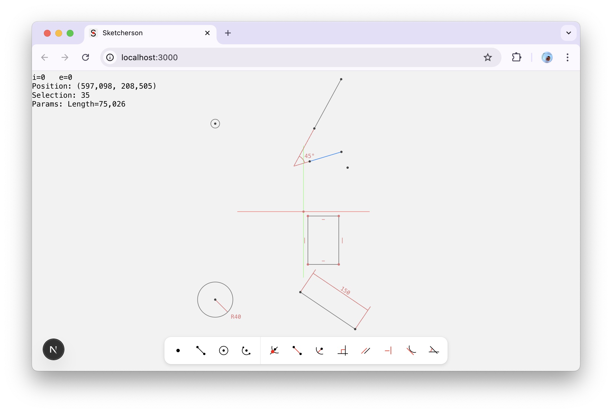

# САПР **Sketcherson**

Проектирование двумерных чертежей.

## Мотивация

- Фокус на двумерных чертежах.
- Открытый исходный код.
- Минимализм в интерфейсе.

Я ориентируюсь на **FreeCAD**, **КОМПАС-3D** и **Onshape** по части возможностей. В большей степени FreeCAD кажется наиболее удачным в реализации базовой геометрии и ограничений. Но в нем не самым лучшим образом реализована функция средней точки. Есть вопросы и к удобству инструментов: массивы и смещение геометрии.

Нет цели создать инструмент, который будет лучше и богаче ориентиров. Sketcherson должен быть лучшим на своем поле: веб-сайт, где можно в один клик начать чертеж. Также просто, как в **draw.io**.

### Интерфейс

Мне нравится, как **Figma** решила вопрос интерфейса. Крайне богатый по функционалу инструмент дизайнера, который встречает всего несколькими кнопками для переключения инструментов. Их решение с парящей панелью снизу - свежо!

Неплохо интерфейс реализован в Onshape.

### Деньги

В данный момент коммерческая цель отсутствует. САПР должен быть доступен каждому, даже без регистрации.

## Решение системы ограничений

Это самая хитрая часть проекта. Она требует крепкого математического фундамента знаний. У меня нет их в полном объеме, поэтому решение строится на том, что есть.

Сейчас система ограничений решается при помощи градиентного спуска. Для каждого ограничения вычисляется ошибка от значения параметров и градиенты для этих параметров для минимизации функции ошибки. Алгоритм минимизирует суммарную ошибку всех ограничений.

У реализации есть проблемы, поэтому работа с ограничениями далека от идеала. Очень часто решение с должным уровнем ошибки не находится: система застревает в локальном минимуме. Также есть определенные проблемы с масштабом некоторых ограничений.

В будущем предполагается использовать **SVD** для решения невязок. Это один из алгоритмов, используемых во FreeCAD.

## Стек

- TypeScript
- React
- Zustand
- Emotion
